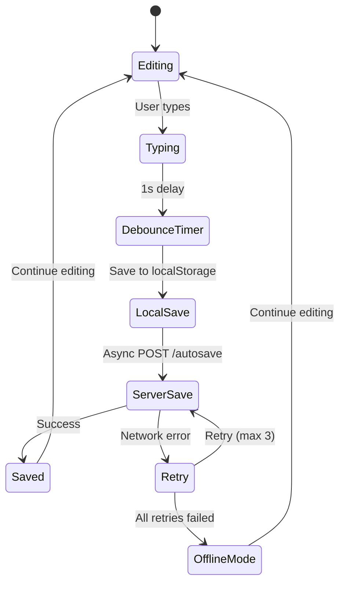
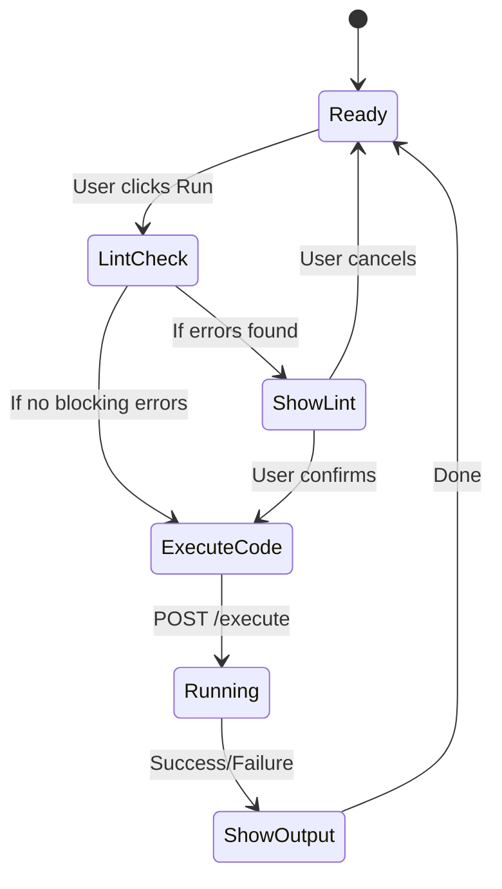

# Editor UX Enhancement Prototype

## Overview

This document provides a detailed UI/UX prototype for enhancing the exercise editor experience in the CS146S learning platform. The enhancements focus on improving code editing workflow, providing real-time feedback, and ensuring a professional development environment.

## Component Hierarchy

```
ExerciseEditorPage
├── Header (breadcrumb + exercise info)
├── EditorContainer
│   ├── MonacoEditor
│   │   ├── CodeContent
│   │   ├── LineNumbers
│   │   ├── SyntaxHighlighting
│   │   ├── ErrorDecorations (dynamic)
│   │   └── CursorPosition
│   ├── EditorToolbar
│   │   ├── RunButton
│   │   │   ├── Icon (play/pause)
│   │   │   └── StatusIndicator (idle/running)
│   │   ├── FormatButton
│   │   │   └── Icon (format)
│   │   ├── SaveIndicator
│   │   │   ├── AutoSaveIcon (cloud/cloud-off)
│   │   │   ├── SaveStatus (saved/saving/unsaved)
│   │   │   └── LastSaveTime
│   │   └── SettingsButton (dropdown)
│   │       ├── ThemeSelector (light/dark)
│   │       ├── LineNumbersToggle
│   │       ├── TabSizeSelector (2/4 spaces)
│   │       └── KeyboardShortcutsHelp
├── LintPanel (collapsible)
│   ├── PanelHeader
│   │   ├── ToggleButton
│   │   ├── IssueCountBadge
│   │   └── ClearButton
│   └── IssueList
│       ├── IssueItem[]
│       │   ├── SeverityIcon (error/warning/info)
│       │   ├── Message
│       │   ├── Location (line:col)
│       │   └── QuickFixButton (optional)
├── OutputPanel
│   ├── PanelHeader
│   │   ├── TabSwitcher (stdout/stderr)
│   │   ├── CopyButton
│   │   ├── ClearButton
│   │   └── ExecutionTime
│   └── OutputContent
│       ├── StdoutViewer (with syntax highlighting)
│       └── StderrViewer (with error highlighting)
├── SubmitPanel
│   ├── SubmitButton
│   └── AttemptCounter
└── AISidebar
    ├── ExplainButton
    ├── DebugButton
    └── HintButton
```

## UI Wireframes

### 1. Enhanced Editor Interface

```
┌─────────────────────────────────────────────────────────────┐
│ [Breadcrumb] CS146S > Week 1 > Exercise 1                   │
├─────────────────────────────────────────────────────────────┤
│ ┌─ Exercise Info ──────────────────────────────────────────┐ │
│ │ Title: Basic Python Functions                           │ │
│ │ Difficulty: Beginner | Points: 10 | Time: 30min        │ │
│ └─────────────────────────────────────────────────────────┘ │
├─────────────────────────────────────────────────────────────┤
│ ┌─ Editor Toolbar ─────────────────────────────────────────┐ │
│ │ ▶ Run  │ ⏸ Pause │ 🎨 Format │ ☁️ Saved 2s ago │ ⚙️ ⋯ │ │
│ └─────────────────────────────────────────────────────────┘ │
├─────────────────────────────────────────────────────────────┤
│ ┌─ Monaco Editor ──────────────────────────────────────────┐ │
│ │ def fibonacci(n):                                       │ │
│ │     if n <= 1:                                          │ │
│ │         return n                                        │ │
│ │     return fibonacci(n-1) + fibonacci(n-2)    ~~~~~~   │ │
│ │                                                ^^^^^^^   │ │
│ │ [Error: Missing return statement]                       │ │
│ └─────────────────────────────────────────────────────────┘ │
├─────────────────────────────────────────────────────────────┤
│ ┌─ Lint Panel (3 issues) ────────────────────── ☰ ────────┐ │
│ │ ⚠️ Line 5: Missing return statement                     │ │
│ │ ℹ️ Line 2: Consider using type hints                     │ │
│ │ ⚠️ Line 4: Recursion depth may exceed limit             │ │
│ └─────────────────────────────────────────────────────────┘ │
├─────────────────────────────────────────────────────────────┤
│ ┌─ Output ──────────────────────────────────────── 📋 ──┐ │
│ │ [STDOUT]                                               │ │
│ │ Result: 55                                             │ │
│ │ Execution time: 0.023s                                │ │
│ └─────────────────────────────────────────────────────────┘ │
└─────────────────────────────────────────────────────────────┘
```

### 2. Settings Dropdown

```
┌─ Editor Settings ──────────────────┐
│ Theme:                             │
│   ○ Light                         │
│   ● Dark                          │
│                                   │
│ Line Numbers: [✓]                 │
│                                   │
│ Tab Size:                         │
│   ○ 2 spaces                      │
│   ● 4 spaces                      │
│                                   │
│ ────────────────────────────────── │
│ Keyboard Shortcuts:               │
│   Ctrl+Enter: Run                 │
│   Ctrl+S: Save                    │
│   Ctrl+Shift+F: Format            │
│   Ctrl+/: Toggle Comment          │
│                                   │
│   [Close]                         │
└─────────────────────────────────────────────────┘
```

### 3. Lint Panel States

```
┌─ Lint Panel ──────────────────────────────────────────────┐
│ ┌─ Collapsed ────────────────────────────────────────────┐ │
│ │ ⚠️ 2 issues found (click to expand)                   │ │
│ └─────────────────────────────────────────────────────────┘ │
│                                                           │ │
│ ┌─ Expanded ─────────────────────────────────────────────┐ │
│ │ Issues (2)                                           ✕ │ │
│ │ ⚠️ Line 3: Undefined variable 'x'                     │ │
│ │ ⚠️ Line 5: Function may not return a value           │ │
│ │                                                       │ │
│ │ [Clear All] [Auto-fix]                               │ │
│ └─────────────────────────────────────────────────────────┘ │
└─────────────────────────────────────────────────────────────┘
```

## Interaction Flows

### 1. Autosave Flow



### 2. Code Execution Flow



### 3. Error Highlighting Flow

```mermaid
graph TD
    A[User types code] --> B[Debounced lint request]
    B --> C[POST /api/v1/exercises/{id}/lint]
    C --> D[Server analyzes code]
    D --> E[Return issues array]
    E --> F[Frontend receives response]
    F --> G[Parse issues by line/column]
    G --> H[Create Monaco decorations]
    H --> I[Apply error markers]
    I --> J[Show lint panel]
    J --> K[User sees highlighted errors]
```

## CSS Design System

### Color Palette

```css
:root {
  /* Editor Colors */
  --editor-bg: #1e1e1e;
  --editor-fg: #d4d4d4;
  --editor-selection: #264f78;
  --editor-line-highlight: #2d2d30;

  /* Status Colors */
  --success: #28a745;
  --warning: #ffc107;
  --error: #dc3545;
  --info: #17a2b8;

  /* UI Colors */
  --toolbar-bg: #f8f9fa;
  --panel-bg: #ffffff;
  --border-color: #dee2e6;
  --text-muted: #6c757d;
}
```

### Component Styles

#### Autosave Indicator
```css
.autosave-indicator {
  display: inline-flex;
  align-items: center;
  gap: 0.5rem;
  font-size: 0.875rem;
  color: var(--text-muted);
}

.autosave-indicator.saving::before {
  content: "⟳";
  animation: spin 1s linear infinite;
}

.autosave-indicator.saved::before {
  content: "☁️";
  color: var(--success);
}

.autosave-indicator.unsaved::before {
  content: "💾";
  color: var(--warning);
}
```

#### Lint Panel
```css
.lint-panel {
  border: 1px solid var(--border-color);
  border-radius: 0.375rem;
  background: var(--panel-bg);
}

.lint-panel.collapsed {
  max-height: 2.5rem;
  overflow: hidden;
}

.lint-issue {
  display: flex;
  align-items: center;
  gap: 0.5rem;
  padding: 0.5rem;
  border-bottom: 1px solid var(--border-color);
}

.lint-issue.error { border-left: 3px solid var(--error); }
.lint-issue.warning { border-left: 3px solid var(--warning); }
.lint-issue.info { border-left: 3px solid var(--info); }
```

#### Editor Toolbar
```css
.editor-toolbar {
  display: flex;
  align-items: center;
  gap: 0.5rem;
  padding: 0.5rem 1rem;
  background: var(--toolbar-bg);
  border-bottom: 1px solid var(--border-color);
}

.toolbar-button {
  display: inline-flex;
  align-items: center;
  gap: 0.375rem;
  padding: 0.375rem 0.75rem;
  border: 1px solid var(--border-color);
  border-radius: 0.25rem;
  background: white;
  color: var(--text-color);
  text-decoration: none;
  font-size: 0.875rem;
  cursor: pointer;
  transition: all 0.15s ease;
}

.toolbar-button:hover {
  background: var(--border-color);
  border-color: #adb5bd;
}

.toolbar-button:active {
  background: #e9ecef;
}

.toolbar-button.primary {
  background: var(--primary);
  color: white;
  border-color: var(--primary);
}
```

## JavaScript Architecture

### Module Structure

```javascript
// editor.js - Main editor module
class ExerciseEditor {
  constructor(options) {
    this.exerciseId = options.exerciseId;
    this.editor = null;
    this.autosaveTimer = null;
    this.lintDecorations = [];
    this.settings = this.loadSettings();
    this.init();
  }

  async init() {
    await this.initMonaco();
    this.setupAutosave();
    this.setupKeyboardShortcuts();
    this.bindEvents();
    this.loadDraft();
  }

  // ... methods
}

// autosave.js - Autosave functionality
class AutosaveManager {
  constructor(editor, api) {
    this.editor = editor;
    this.api = api;
    this.timer = null;
    this.retryCount = 0;
  }

  scheduleSave() {
    this.debouncedSave();
  }

  // ... implementation
}

// lint.js - Code linting
class LintManager {
  constructor(editor, api) {
    this.editor = editor;
    this.api = api;
    this.issues = [];
  }

  async checkCode() {
    const code = this.editor.getValue();
    const result = await this.api.lint(this.exerciseId, code);
    this.displayIssues(result.issues);
  }

  // ... implementation
}
```

### Event Handling

```javascript
// Event system for loose coupling
class EditorEvents {
  constructor() {
    this.events = {};
  }

  on(event, callback) {
    if (!this.events[event]) {
      this.events[event] = [];
    }
    this.events[event].push(callback);
  }

  emit(event, data) {
    if (this.events[event]) {
      this.events[event].forEach(callback => callback(data));
    }
  }
}

// Usage
const events = new EditorEvents();

events.on('codeChanged', (data) => {
  // Handle code change
  lintManager.scheduleCheck();
  autosaveManager.scheduleSave();
});

events.on('runRequested', (data) => {
  // Handle run request
  if (lintManager.hasBlockingErrors()) {
    // Show confirmation dialog
  } else {
    executor.runCode();
  }
});
```

## API Integration

### Frontend API Client

```javascript
class ExerciseAPI {
  constructor(baseUrl = '/api/v1') {
    this.baseUrl = baseUrl;
  }

  async autosave(exerciseId, data) {
    return this.request('POST', `/exercises/${exerciseId}/autosave`, data);
  }

  async lint(exerciseId, code) {
    return this.request('POST', `/exercises/${exerciseId}/lint`, { code });
  }

  async format(exerciseId, code) {
    return this.request('POST', `/exercises/${exerciseId}/format`, { code });
  }

  async request(method, endpoint, data = null) {
    const config = {
      method,
      headers: {
        'Content-Type': 'application/json',
        'X-CSRFToken': this.getCsrfToken()
      }
    };

    if (data) {
      config.body = JSON.stringify(data);
    }

    const response = await fetch(`${this.baseUrl}${endpoint}`, config);

    if (!response.ok) {
      throw new Error(`API Error: ${response.status}`);
    }

    return response.json();
  }

  getCsrfToken() {
    // Extract CSRF token from meta tag or cookie
    return document.querySelector('meta[name="csrf-token"]')?.content ||
           this.getCookie('csrf_token');
  }
}
```

## Accessibility Considerations

### Keyboard Navigation
- All toolbar buttons are keyboard accessible (Tab order)
- Keyboard shortcuts can be disabled via settings
- Screen reader support for error messages and status updates

### Visual Indicators
- Color-blind friendly color schemes
- High contrast mode support
- Clear visual feedback for all interactive elements

### Error Communication
- Screen reader announcements for lint errors
- Clear, descriptive error messages
- Progress indicators for long-running operations

## Performance Optimization

### Debouncing
```javascript
function debounce(func, wait) {
  let timeout;
  return function executedFunction(...args) {
    const later = () => {
      clearTimeout(timeout);
      func(...args);
    };
    clearTimeout(timeout);
    timeout = setTimeout(later, wait);
  };
}

// Usage
const debouncedLint = debounce(() => lintManager.checkCode(), 500);
const debouncedAutosave = debounce(() => autosaveManager.save(), 1000);
```

### Virtual Scrolling (Future Enhancement)
For very large code files, implement virtual scrolling to maintain performance.

### Memory Management
- Clean up Monaco editor instances on page unload
- Limit lint issue history to prevent memory leaks
- Use object pooling for frequently created DOM elements

## Testing Strategy

### Unit Tests
- Editor initialization and configuration
- Autosave logic and API calls
- Lint result parsing and decoration application
- Keyboard shortcut handling

### Integration Tests
- Full editor workflow (type → lint → run → submit)
- API error handling and retry logic
- Settings persistence and restoration

### E2E Tests
- User journey from loading page to successful submission
- Error recovery scenarios (network issues, server errors)
- Accessibility testing with screen readers

## Browser Compatibility

### Supported Browsers
- Chrome 90+
- Firefox 88+
- Safari 14+
- Edge 90+

### Fallbacks
- Graceful degradation for older browsers
- Feature detection for advanced functionality
- Mock implementations for unsupported features

## Implementation Checklist

### Phase 1: Core Infrastructure
- [ ] Create modular JavaScript architecture
- [ ] Implement API client wrapper
- [ ] Set up event system
- [ ] Create CSS design system

### Phase 2: Autosave Feature
- [ ] Implement localStorage persistence
- [ ] Create server-side autosave endpoint
- [ ] Add visual save indicators
- [ ] Handle offline scenarios

### Phase 3: Lint Integration
- [ ] Implement server-side linting
- [ ] Create Monaco decorations system
- [ ] Build collapsible lint panel
- [ ] Add error navigation

### Phase 4: Enhanced UX
- [ ] Implement keyboard shortcuts
- [ ] Add editor settings panel
- [ ] Improve output panel with tabs
- [ ] Add execution time display

### Phase 5: Polish and Testing
- [ ] Performance optimization
- [ ] Accessibility improvements
- [ ] Comprehensive testing
- [ ] Documentation updates
